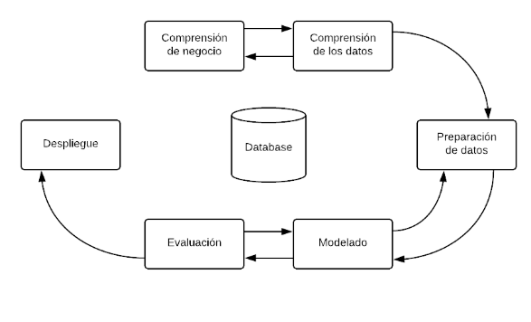

# Metodología de Desarrollo	

```{r echo=FALSE, out.width='100%'}

```

Debido a la naturaleza del proyecto se utilizó una adaptación de la metodología Cross Industry Standard Process for Data Mining (CRISP-DM por sus siglas en inglés). Esta metodología provee un marco de referencia para llevar a cabo proyectos relacionados con análisis de datos sin importar el sector en el que este se lleve a cabo.


Las fases por las que se llevó a cabo el proyecto fueron:

##Comprensión del negocio.
Fase inicial, se enfocó en el entendimiento de los objetivos y requerimientos desde la perspectiva de negocio. 
Se definieron las características y los requerimientos de la primer versión de la Calculadora Logística, para poder tener un producto mínimo viable. En esta etapa también se empezó a ver los esfuerzos anteriores por los que habían pasado algunos de los elementos del proyecto, como lo fue el código para la extracción de datos de precios en las centrales de abasto.
Los elementos principales que se definieron para el desarrollo de la Calculadora Logística fueron los siguientes:  
- Cálculo de rutas: Se necesitaba tener la capacidad de calcular rutas optimas entre dos puntos así como obtener información de tiempo estimado de recorrido, kilometros, casetas por las que pasaba la ruta así como sus costos, dependiendo del tipo de transporte.   
- Cálculos de precios: Se necesitaba poder obtener de manera periódica la información de precios de distintos cultivos a través de diferentes centrales de abasto.   
- Aplicación web: Se requría hacer una integración de la información arriba recabada de manera que se pudiera sistematizar y desplegar de cara al usuario final.  

##Comprensión y preparación de los Datos.

Se hizo una investigación de posibles fuentes de datos que pudieran servir para cada uno de los propósitos.

Para el cálculo de rutas se revisaron las bases de datos de casetas, autopistas, vías libres, así como la API de ruteo de Google. De igual manera se revisó la API de ruteo SAKBÉ, desarrollada por el INEGI. Se decidió usar esta última opción dado que ya tiene integrado los precios de las casetas de manera natural y no hay que hacer un proceso de búsqueda como tendría que hacerse utilizando la API de Google.

Se revisó la documentación y se estudió la manera en la que se hacen las peticiones a la API así como los datos que esta puede arrojar y las estructuras en las que lo hace.

Para los datos de precios se revisó el código en python que se había desarrollado para este propósito. Después de estudiar cómo funcionaba y la estructura de la página del SNIIM, en donde se encuentran alojados estos datos, se hicieron las modificaciones necesarias y se crearon los diccionarios de claves de cultivos y claves de centrales de abasto, para poder automatizar el proceso de extracción de precios.

##Modelado y evaluación.

Con la información disponible, nos dimos a la tarea de hacer dos algoritmos:

El primero con la finalidad de calcular la ganancia de llevar cierta cantidad de un producto a un punto. Esto a través de la siguiente fórmula:  
$$Ganancia=(Precio Del Producto *Cantidad De Producto) - (Costo De Gasolina + Costos De Casetas)$$  
Obteniendo la información necesaria para hacer este cálculo de los dos componentes definidos en el punto anterior: Cálculo de precios y cálculo de costos.

El segundo algoritmo tuvo la finalidad de hacer más eficiente la búsqueda de las ganancias a través de los diferentes Centrales de Abasto. Con la finalidad de evitar hacer este cálculo para todas las Centrales de Abasto en cada una de las consultas, se decidió acotar la búsqueda a las Centrales más cercanas al punto de origen e irla ampliando paulatinamente en medida de que la probabilidad de encontrar un punto con una ganancia mayor no disminuyera.


##Despliegue
El proceso de preparación de datos y modelado fue seguido en todo momento por el equipo de desarrollo, quienes empezaron a trabajar con la información que se tuvo disponible primero para empezar a desarrollar la aplicación web y la lógica del modelo en un ambiente productivo.

Una vez que se vió qué insumos necesitaban los modelos y que iba a tener como resultados, el siguiente paso fue ver de qué manera se iba a ingresar la información y cómo iba a consumir los resultados el usuario final.

Una vez con esto se hizo la primer versión de la Aplicación Web de la Agricultura Logística que incluía el módulo de Cálculo de Costo. 

El desarrollo de la versión en productivo del módulo de Cálculo de precios fue más complicado. Se probó una versión que utilizaba el código antes revisado en python para calcular los costos una vez que se introducía la información del cultivo, pero este resultó ser muy lento, además de que había un alto índice de fallo al obtener la información de la página del SNIIM.

Una vez descartada esta versión, se decidió hacer un sistema que todas las noches obtuviera los precios de los cultivos, esto de manera más controlada evitando la saturación del SNIIM. Esta información se vació en una base de datos que es la que se cultiva cada vez que el usuario ingresa los datos. Esto aumentó la velocidad de respuesta del sistema.
